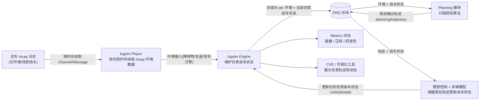

```mermaid
```mermaid
flowchart LR
    Mcap["实车 mcap 日志<br/>(仅环境/场景相关)"]
    Player["logsim Player<br/>按仿真时间读取 mcap 环境数据"]
    Engine["logsim Engine<br/>维护仿真自车状态"]
    ZMQ[("ZMQ 总线")]
    Plan["Planning 模块<br/>只跑规划算法"]
    Model["理想控制 + 车辆模型<br/>根据规划轨迹更新自车状态"]
    Metrics["Metrics 评估<br/>碰撞 / 压线 / 舒适性"]
    Vis["CVE / 可视化工具<br/>展示仿真轨迹和状态"]

    %% ------ 数据流 ------

    Mcap -->|"按时间读取 Channel/Message"| Player
    Player -->|"环境输入(障碍物/车道/信号灯等)"| Engine

    Engine -->|"封装为 pb: 环境 + 当前仿真自车状态"| ZMQ
    ZMQ -->|"环境 + 自车状态"| Plan
    Plan -->|"规划输出轨迹 /planning/trajectory"| ZMQ
    ZMQ -->|"轨迹 + 自车状态"| Model

    Model -->|"更新后的仿真自车状态 /vehicle/state"| Engine

    Engine --> Metrics
    Engine --> Vis

```
```